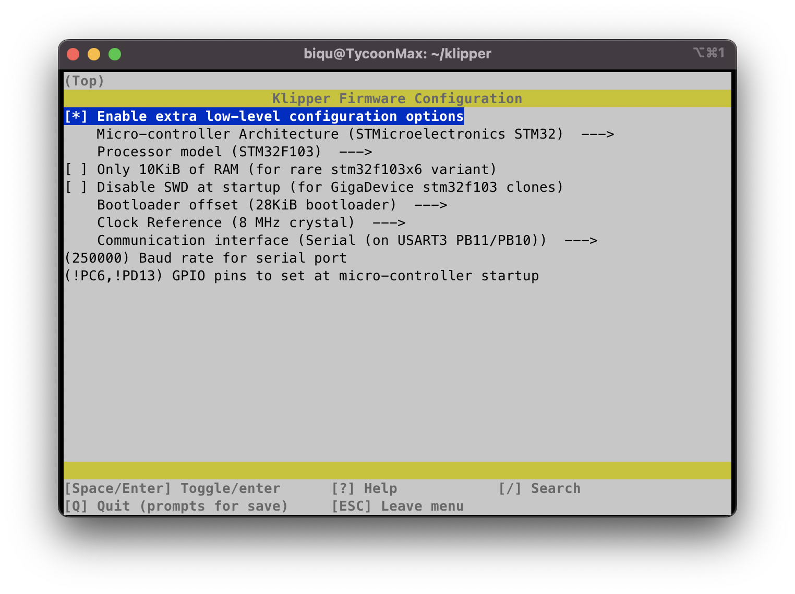

# Klipper for Kywoo3D Tycoon Max

## Specification

Item | Description
-- | --
Printer | Kywoo3D Tycoon Max
Board (MCU) | Kywoo v1.4 (MKS Robin Nano v3 based)
Klipper Board | BIGTECHTREE CM4 + PI4B Adapter

## Firmware 



## Instructions


1. Enter klipper firmware configuration:
```bash
> cd  ~/klipper
> make menuconfig
```

2. Set parameters as on [Firmware](#firmware) section and save;

3. Build the new bin file through make command:
```bash
> make
```

4. Run the fix script for mks boards and move the result file to configuration folder:
```bash
> ./scripts/update_mks_robin.py out/klipper.bin out/Robin_nano35.bin
> cp out/Robin_nano35.bin ~/printer_data/config/
>
```

5. Download the bin file from Moonrake interface and follow the instructions on Kywoo site to flash it.